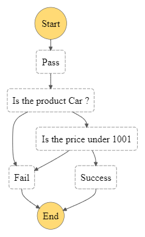

# JsonPath Implementation for AWS StateMachines

Using state machines mostly is a good way to make the decision process readable for the people. However, sometimes it could be hard to deal with a little more complex situations. In this blog post, we will discuss the problem we faced and how we solved it.

## The Problem

We had data like below,

```json
{
  "seller": {
    "personID": "123124",
    "name": "berat",
    "surName": "Dinckan",
    "products": [
      {
        "category": "realty",
        "productType": "house",
        "price": 50000,
        "country": "Turkiye"
      },
      {
        "category": "vahicle",
        "productType": "car",
        "price": 10000,
        "country": "Turkiye",
        "color": "RED"
      },
      {
        "category": "technology",
        "productType": "laptop",
        "price": 1000
      }
    ]
  }
}
```

At this point, all products are unique so every different category has one data. We need a product whose "category" is the "vehicle". We tried the lambda function and the map to solve this problem. For this case,unfortunately the map didn't work as we expected. The map executed all iterations even an item didn't match the what expected. So we added succes and fail probs end of the map but this state machine was too complicated and hard to grasp. After the map, we put a lambda function to filter the data and we said If we are using lambda functions to filter the data what is the matter of using state machines. It was still complicated and if an error has existed the developers would have to take a look at the lambda function to see what was going on. There must be another way.

# JsonPath Implementation

Finally, we found [an example of filtering the JSON data](https://goessner.net/articles/jsonpath/index.html#e3) According to this website, we can filter arrays by using some symbols. We decided to redesigned te state machine.

## Side Note: To make it clear, I kept the state machine as simple as I can.

The state machine :

<!--  -->
<p align="center" width="%100">
     
</p>

The state machine as json:

```json
{
  "Comment": "A description of my state machine",
  "StartAt": "Pass",
  "States": {
    "Pass": {
      "Type": "Pass",
      "Next": "Is the product Car ?",
      "Parameters": {
        "seller.$": "$.seller",
        "filteredProducts.$": "$.seller.products[?(@.category == 'vahicle')]"
      }
    },
    "Is the product Car ?": {
      "Type": "Choice",
      "Choices": [
        {
          "And": [
            {
              "Variable": "$.filteredProducts",
              "IsPresent": true
            },
            {
              "Variable": "$.filteredProducts[0].productType",
              "StringEquals": "car"
            }
          ],
          "Next": "Is the price under 1001"
        }
      ],
      "Default": "Fail"
    },
    "Is the price under 1001": {
      "Type": "Choice",
      "Choices": [
        {
          "Variable": "$.filteredProducts[0].price",
          "NumericLessThan": 1001,
          "Next": "Success"
        }
      ],
      "Default": "Fail"
    },
    "Fail": {
      "Type": "Fail"
    },
    "Success": {
      "Type": "Succeed"
    }
  }
}
```

Parameters in the pass state:

```json
{
  "seller.$": "$.seller",
  "filteredProducts.$": "$.seller.products[?(@.category == 'vahicle')]"
}
```

Did you notice something ? We have "@" and "?" symbols. What do they mean ?

You can think the "?" as a filter statement and "@" represents the every each object in products array. This jsonPath filter section returns us an array. if there is no data macthing,jsonPath filter section returns us an empty array. This filtering system is like the javascript code below:

```js
const filteredProducts = seller.producs.filter((product) => {
  return product.category == "vahicle";
});
```

We can start a new execution on our state machine by using the data that we have. After filtering the data, the step input of the choice called "Is the product Car ?" must be like below:

```json
{
  "seller": {
    "personID": "123124",
    "name": "berat",
    "surName": "Dinckan",
    "products": [
      {
        "category": "realty",
        "productType": "house",
        "price": 50000,
        "country": "Turkiye"
      },
      {
        "category": "vahicle",
        "productType": "car",
        "price": 10000,
        "country": "Turkiye",
        "color": "RED"
      },
      {
        "category": "technology",
        "productType": "laptop",
        "price": 1000
      }
    ]
  },
  "filteredProducts": [
    {
      "category": "vahicle",
      "productType": "car",
      "price": 10000,
      "country": "Turkiye",
      "color": "RED"
    }
  ]
}
```

Now we have a new property called "filteredProducts" that contains a filtered array.

## What would happen if there were other conditions?

We can use different if statements in the jsonPath depending on different conditions. For instance:

## let's filter the json data by price

This jsonPath checks if the price property of every object in the products array is less than 1000

```json
{
  "seller.$": "$.seller",
  "filteredProducts.$": "$.seller.products[?(@.price <1000)]"
}
```

## Also, we can check if a property persists or not

This jsonPath checks if the color property of every object in the products array persists

```json
{
  "seller.$": "$.seller",
  "filteredProducts.$": "$.seller.products[?(@.color)]"
}
```

# Final Thoughts

If you need to filter data on the state machine, you can try JsonPath instead of lambda. It looks way clearer, simpler, and easier to grasp.

Thanks for reading.
